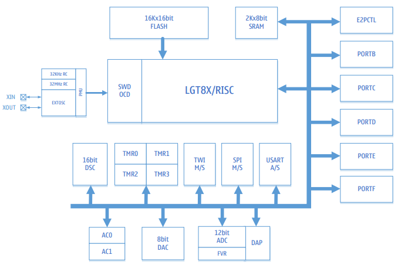
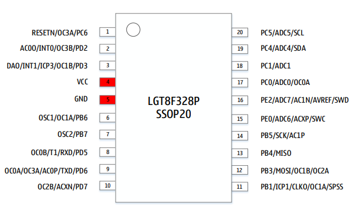

# [LGT8F328P](https://github.com/SoCXin/LGT8F328P)

* [LogicGreen](http://www.lgtic.com/): [AVR](https://github.com/SoCXin/8051)
* [L2R2](https://github.com/SoCXin/Level): 32 MHz

## [简介](https://github.com/SoCXin/LGT8F328P/wiki)

[LGT8F328P](https://github.com/SoCXin/LGT8F328P) 与Atmel ATMega328P微控制器相似，并增加了诸如DAC输出，PWM特定功能，计算加速器(DSC)等功能。MCU的时钟速度也是双倍(32 MHz)，与ATMEGA328P MCU兼容99%。

LGT8F328P集成了丰富的模拟外设, 包括12位ADC, 可编程增益差分放大器, 高精度1.024/2.048/4.096V内部参考电压, 8位DAC以及高速模拟比较器; 同时LGT8F328P内部也集成了常用的数字接口控制器, 支持多路互补PWM输出以及死区控制。

基于FLASH工艺，定位于中高端8位MCU市场, 内部集成32MHz高精度低温漂(±0.5%)的RC振荡器, 12位高精度ADC转换器, 1.024V/2.048V/4.096V高精度参考电压以及可编程增益差分放大器; LGT8F328P集成2×8位+2×16位定时器, 2个增强PWM发生器, 可产生三组支持死区控制与自动关闭保护的互补PWM. 这些特性使得LGT8F328P非常适用于DC/DC, 马达驱动以及家电等消费类以及工业级应用市场。

### 关键特性

* 兼容Arduino AVR
* 32K FLASH + 2K SRAM
* 8bit DAC, PGA
* 12bit ADC
* 1.8V – 5.5V

### [资源收录](https://github.com/SoCXin)

* [参考资源](src/)
* [参考文档](docs/)
* [参考工程](project/)

### [选型建议](https://github.com/SoCXin)

[LGT8F328P](https://github.com/SoCXin/LGT8F328P) 属于flash工艺产品，类似AVR单片机，实现相关兼容，用于Arduino芯片国产化替换。

* QFP48 (7×7mm)
* QFP32 (7×7mm)
* SSOP20

### [探索芯世界 www.SoC.xin](http://www.SoC.Xin)
